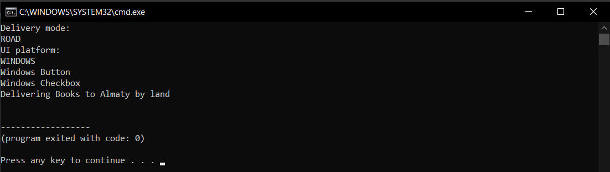

# Logistics Application

A Java application demonstrating two design patterns:
- Factory Method — creates Truck and Ship.
- Abstract Factory — creates Windows and macOS Button and Checkbox components.

Platform:
- WINDOWS
- MACOS

Invalid or missing input displays an error message and stops the application.

Packages
- `Logistics` — Factory Method implementation
- `Factory` — Abstract Factory implementation
- `DeliveryApplication` — application client
- `Main` — program entry point

### How to Run
There are two ways to run the code. With terminal and with Java IDE.

For Java IDE (such as IntelliJ IDEA):
1. Download and unpack project from `Github`.
2. Open the project in Java IDE.
3. Run the `Main.java`.

For terminal:
1. Download and unpack project from `Github`.
2. Go to the folder with the project. (Use `cd path`, for example `cd C:\Users\Admin\Downloads\factory-pattern`).
3. Run the following command: `java Main`. You must have `java` installed in your device.

